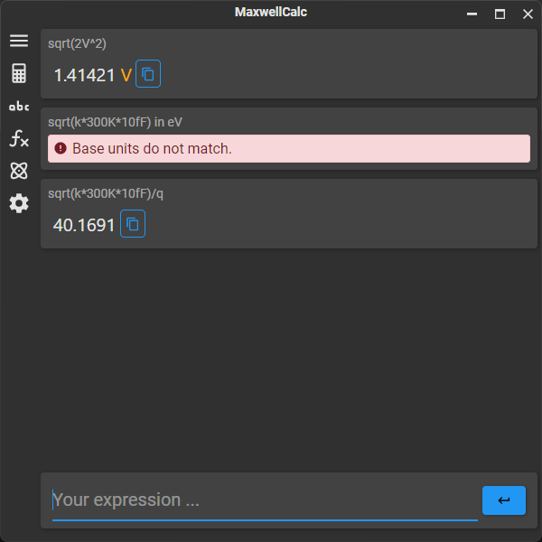

# MaxwellCalc

MaxwellCalc is a calculator application that has support for scientific units. The idea is loosely based on [SpeedCrunch](https://heldercorreia.bitbucket.io/speedcrunch/), but has some differences that are practical in nature.

The project uses the .NET framework with Avalonia for the UI.

## Setup

There are no binaries right now. You simply have to compile the project for the platform that you're interested in.

To get started, simply open the executable and start working. If you would like to quickly insert commonly used units and constants, go to the units or constants pane and right-click in the list of units or constants. You can then select `Add common input and output units`, `Add electrical input and output units` for units, or `Add common constants` to quickly add a set of units/constants that are common in physics and/or electronics engineering.

## Features

- Real and complex numbers are supported.
- A unit system: any input is automatically converted through the "input unit" list to a second set of units ("base units", typically SI units). Calculations are then executed. At the end, the resulting units are converted back to "output units" from the "base units". The output unit is chosen to get as close as possible to a scalar value just above 1.0. This behavior can always be overridden through the `in` operator: `1m/s in km/hour` results in `3.6 km/hour`.
- A set of built-in functions is also available: `abs`, `acos`, `acosh`, `asin`, `asinh`, `atan`, `atan2`, `atanh`, `B`, `BLn`, `cos`, `cosh`, `E1`, `Ei`, `En`, `exp`, `expE1`, `expEi`, `factorial`, `factorialLn`, `Gamma`, `GammaLn`, `ln`, `log10`, `log2`, `max`, `min`, `multinomial`, `round`, `sin`, `sinh`, `sqrt`, `tan`, `tanh`.
- Light and dark themed.
- Different workspaces are allowed (each with their own set of units, variables, constants, etc.)
- Special precedence for implicit multiplication (`1m/1s` = `1 m/s` and not `1 m*s`).